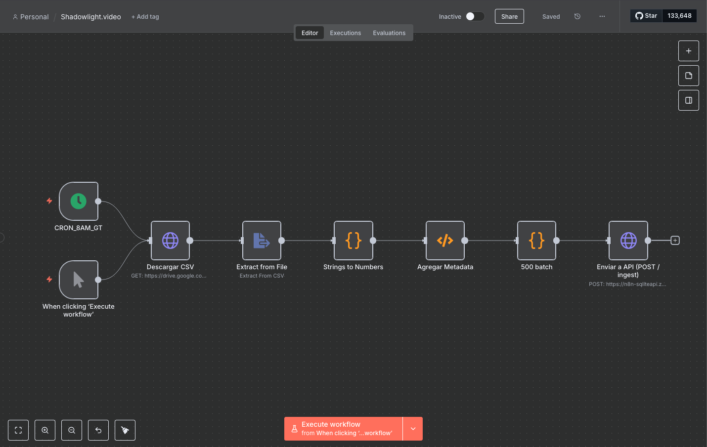

# 🧠 AI + Data Engineer Challenge – 8 Figure Agency

This repository contains the complete solution to the technical challenge for the *AI Data Engineer* role.  
The implementation is minimalist, reproducible, and uses only open-source tools.

---

## ⚙️ Tech Stack

- **FastAPI** + **SQLite** for the ingestion API and KPIs
- **n8n Community Edition** for ingestion orchestration + metrics access
- **Docker** and `Makefile` for local deployment and testing
- **ChatGPT NLP Agent** (optional) to query KPIs using natural language

---

## 📦 Repository Structure

```
.
├── main.py                      # FastAPI with /ingest and /metrics endpoints
├── Dockerfile                   # Docker image for FastAPI service
├── Makefile                     # CLI automation: run, test, build
├── test_payload.json            # Sample bulk insert payload
├── ads_ingest_metrics_workflow_FIXED.json  # n8n workflow
├── requirements.txt
├── README.md
├── ShadowLightChart1.png
├── ShadowLightChart2.png
├── ShadowLightChart3.png
├── ShadowLightChart4.png
├── ShadowLightChart5.png
└── n8n.png
```

---

## 🚀 Local Deployment

```bash
make run           # Launches API on localhost:8500
make test-ingest   # Bulk inserts test records
```

SQLite database is stored in `data/ads.db`.

You can also deploy the API using Docker.  
It is currently hosted on a cloud container I built and published via EasyPanel:

```
https://n8n-sqliteapi.zfrap0.easypanel.host
```

---

## 🔄 Data Ingestion with n8n

The following diagram shows how the n8n automation workflow is structured:



Steps:

1. Open your n8n instance (`http://localhost:5678`)
2. Import `ads_ingest_metrics_workflow_FIXED.json`
3. Update the `POST /ingest` node URL to `http://localhost:8500/ingest` or your own host
4. Enable the workflow (cron: every 60 minutes)
5. Run manually or let it schedule automatically

---

## 📊 KPIs exposed at `/metrics`

### Option 1 – Direct date range:

```bash
GET /metrics?start=2025-03-01&end=2025-04-01
```

Returns:

```json
{
  "spend": 269988.28,
  "conversions": 8908,
  "cac": 30.31,
  "roas": 3.30
}
```

### Option 2 – Last 30 days vs Previous 30 days

```bash
GET /metrics?compare=last30_prev30
```

Returns:

```json
{
  "last_30d": {
    "spend": 269988.28,
    "conversions": 8908,
    "cac": 30.31,
    "roas": 3.30
  },
  "prev_30d": {
    "spend": 240000.00,
    "conversions": 7500,
    "cac": 32.00,
    "roas": 3.12
  },
  "delta_pct": {
    "spend": 0.12,
    "conversions": 0.18,
    "cac": -0.052,
    "roas": 0.058
  }
}
```

The comparison logic is implemented directly in the API logic.

---

## 💬 NLP Metrics Agent (Private)

A custom **AI-powered chatbot** is available for 1 week to query the API using natural language (English or Spanish).

> Available **on request only**. Please contact me if you'd like to interact with the chatbot.  
> Example: “Compare CAC between April and July”, “What’s the ROAS this month?”

---

## 📎 Challenge Reference

- CSV file: `ads_spend.csv` (Google Drive)
- Deliverables: working ingestion API, KPI logic, n8n workflow, README, and optional demo video

---

## 📐 KPI Formulas

```sql
-- CAC: Customer Acquisition Cost
SELECT SUM(spend)/NULLIF(SUM(conversions),0) AS CAC FROM ads_spend;

-- ROAS: Return On Ad Spend
SELECT (SUM(conversions)*100.0)/NULLIF(SUM(spend),0) AS ROAS FROM ads_spend;
```

> Assumes: `revenue = conversions × 100`

---

## 📹 Loom Demo (optional)

👉 [Link to be added here]

Video should explain:

- How data is ingested via n8n
- How KPIs like CAC and ROAS are calculated
- How to use the `/metrics` endpoint
- Any implementation decisions or trade-offs

---

## 🖼️ Visual Charts

Here are key visual outputs generated during the challenge:

### 📈 CAC & ROAS Over Time


### 📊 Spend vs Conversions


### 📉 CAC Comparison (Last 30 vs Previous 30 Days)


### 📈 ROAS Comparison (Last 30 vs Previous 30 Days)


### 📊 Summary Dashboard Snapshot


---

## 👤 Author

**Eliab Lemus Barrios**  
Guatemala 🇬🇹  
DevOps | Data Engineer | SRE  
